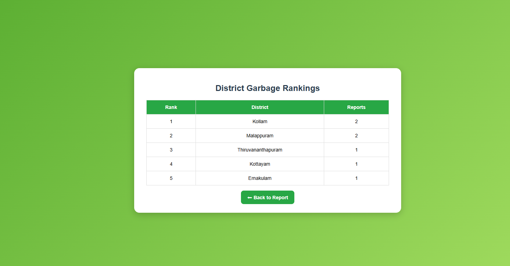
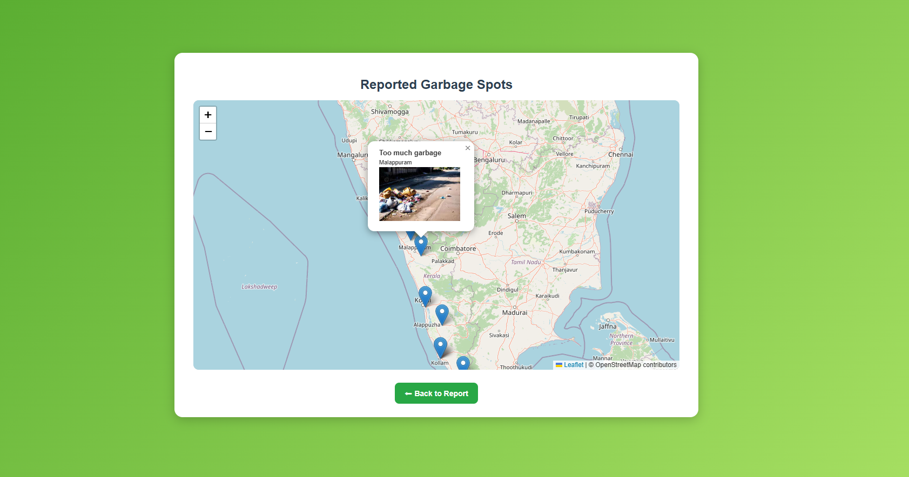
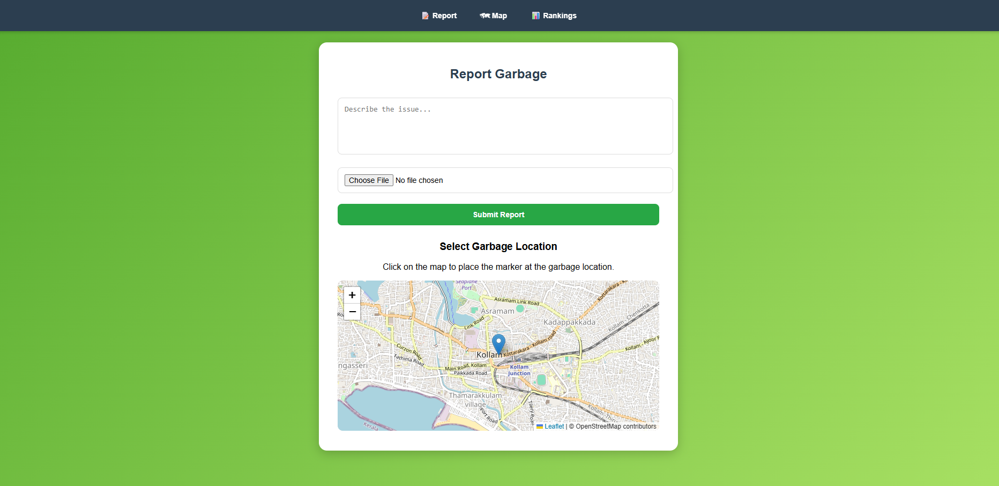

# 🚮 TrashTrack

## 1. Project Title  
**TrashTrack** – Community-Driven Garbage Reporting & District Cleanliness Tracker  

---

## 2. Description  
TrashTrack is a web application that allows citizens to **report garbage spots** in their locality by uploading a picture and selecting the location on an interactive map.  

🌍 Why it matters:  
- Overflowing garbage bins and illegal dumping are major urban problems in India.  
- Municipalities struggle due to lack of **real-time data**.  
- Citizens don’t have a simple, transparent way to report and track garbage issues.  

👥 Target users:  
- General public (to report garbage)  
- Municipal authorities (to act on reports)  
- NGOs / Cleanliness drives (to identify hotspots)  

---

## 3. Features  
- 📷 Upload a photo of garbage spots  
- 📝 Add description for context  
- 📍 Select location on map (Leaflet + OpenStreetMap)  
- 🔥 Store reports in Firebase Firestore  
- 🗺 View garbage spots on an interactive map  
- 📊 District-wise cleanliness leaderboard (which district has most reports)  
- 🌍 Works on desktop + mobile browser  

---

## 4. Tech Stack  
- **Frontend:** HTML, CSS, JavaScript  
- **Mapping:** Leaflet.js + OpenStreetMap  
- **Backend/Database:** Firebase Firestore  
- **Hosting:** GitHub Pages  
- **Geocoding:** Nominatim (OpenStreetMap API)  

---

## 5. Installation & Setup  

```bash
# Clone the repo
git clone https://github.com/YOUR_USERNAME/TrashTrack.git
cd TrashTrack

# Open index.html directly in browser (no build step needed)
````
## 6. Usage Instructions  
1. Open the app.  
2. Fill description, upload image, and click on the map to mark garbage spot.  
3. Submit → Report is saved in Firestore.  
4. Use **Map page** to see all reports.  
5. Use **Rankings page** to see which district has the most garbage reports.  

💡 
    
    

---

## 7. Demo Link (compulsory)  
- 🌐 Live Website: [https://shyma22.github.io/TrashTrack/](https://shyma22.github.io/TrashTrack/)  
- 🎥 Demo Video: [https://drive.google.com/file/d/1q6-tdcAnHedX6J82bthoWKpMxlX20cWn/view?usp=sharing]  

---

## 8. Contributors  
- **Sahna Sherin** – Frontend + Firebase integration
- **Rifna Sherin** - Frontend
- **Shyma Zuhra** - Firebase integration  


---


